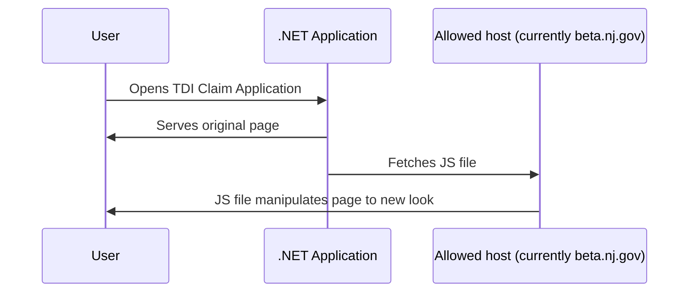

# Paid Leave Benefits - Claim Status and TDI Claim Application

This repository contains the code used to redesign the existing "Claim Status" application used for New Jersey's Temporary Disability Insurance (TDI) and Family Leave Insurance (FLI), managed by the Department of Labor.

## Table of Contents

* Approach
* Setup
* Development
* Testing
* Deployment by Innovation
* Future Deployments

## Approach

JavaScript scripts are injected onto the existing application and manually update the layout and content for a better user experience. Rather than updating the existing JSP code directly, this will enable frequent testing on dev and deployments to prod without OIM as a dependency, both in terms of infrastructure and bandwidth. See `CHANGELOG.md` for list of updates made to production.

The script files are hosted on the `beta.nj.gov` domain and automatically pushed from the `beta` Github repository. This repository houses the code and tests for developing the scripts, while the `beta` repository simply houses the compiled assets that need to be hosted. Note that there is a `dev` and `prod` hosting of the scripts, which corresponds to the dev and prod (https://secure.dol.state.nj.us/DOL_DABI/) versions of the Claim Status application.

The same approach is taken for the TDI Claim Application, which is built on an underlying codebase of .NET 4.0. Thus it is the `.NET Analytics, Modernization, and Accessibility for New Jersey (NAMAN)` approach.



## Setup

1. Clone this `paid-leave-claim-status` repository
2. Use Node 24
3. Run `npm install` to install dependencies
4. Run `npm run build` to build bundled files
5. Run `npm test` to run Cypress tests

## Development

When you make a change and want to see if everything is working, do the following:

1. Edit `.js` file in `src/` directory (edit corresponding Cypress test if relevant)
2. Run `npm run build` to compile files
3. Run `npm test` to ensure tests still pass
4. Open relevant test file in `cypress/fixtures` in browser to ensure change looks okay (See more below in the Testing section).
5. After code review, push changes to `dev` branch.
6. Deploy the changes to the beta environment. See instructions below for deployment.

### User-facing text

To prepare all pages for translation as required by law, the Claim Application uses `i18next` to translate user-facing text. The translation strings are kept in `src/claimApplication/translations.js` and currently only contain English. Future work will be required to set i18next to detect the brower's language settings or have in-app language selection, and to add translations for all required languages.

For example, instead of a name label having its text set directly:

```
nameLabel.textContent = 'Name';
```

we add

```
contact: {
    name: "Name",
    ...
```

to `translations.js` and use

```
nameLabel.textContent = i18next.t('contact.name');
```

## Testing

### Testing locally

You can open the HTML fixture files from `cypress/fixtures` directly in your browser.

New fixture files are needed for specific scenarios. To save new fixture files, navigate to the page in the browser, use the Network debug tab to disable any existing override script from this project, then save the complete page.

### Testing in the Test environment

The following [internal Google Doc](https://docs.google.com/document/d/1XD06eJ9Q6e5z8_fKcQrDs7K6r0lbsqMab_xlikYdqAA/edit?usp=sharing) has URLs and account credentials to test claim status scenarios live in both development and production.

You can use [Local Overrides](https://developer.chrome.com/docs/devtools/overrides) while navigating on the live Test environment to test changes that involve multiple screens. (For TDI Claim Application: Because the underlying pages append the current datetime's minute when fetching the JS override, you need a file for every minute while you are testing. You can use `generateLocalDevOverrides.sh` to generate 20 minutes' worth of override files.)

### Cypress End-to-end Tests

Cypress tests for the TDI Claim Application are arranged like this: 

```
describe("page without new JS", () => {

    // artificially emptying the override script
    beforeEach(() => {
        cy.intercept('**/tdiOverride.min.js', { body: '', disableCache: true }).as('scriptIntercept');
        cy.visit(FIXTURE);
    });

    // tests that demonstrate existing page behavior, checking parameters of post data

});

describe("page with new JS", () => {
    // tests that demonstrate new page behavior, checking same parameters of post data to ensure they are equivalent to before
}

```

## Deployment by Innovation

1. If deploying to production, create a PR to squash & merge changes from `dev` into `prod`.
2. Trigger the `Deploy to Beta` action in the GitHub UI for either `dev` or `prod`. This workflow (defined the same on all branches) will refresh the builds on the specified branch, and make a PR in the `beta` repo.
3. Once the files are merged to the `main` branch of `beta` repo, they will be automatically deployed to `beta.nj.gov` to be referenced by the Claim Status/TDI application.
4. The host at `beta.nj.gov` caches for several hours, so you may not actually see the new files until that refreshes. To force the new file to be served, the .NET layer of the TDI Claim Application attaches an otherwise-unused query parameter that contains the date and time (down to a 1-hour resolution in production, and 1-minute resolution in development, so you will see the new files at that same rate).

## Future Deployments

When deployment moves away from Innovation's ownership, a new approved domain should be used to host the min.js files generated by this project.
